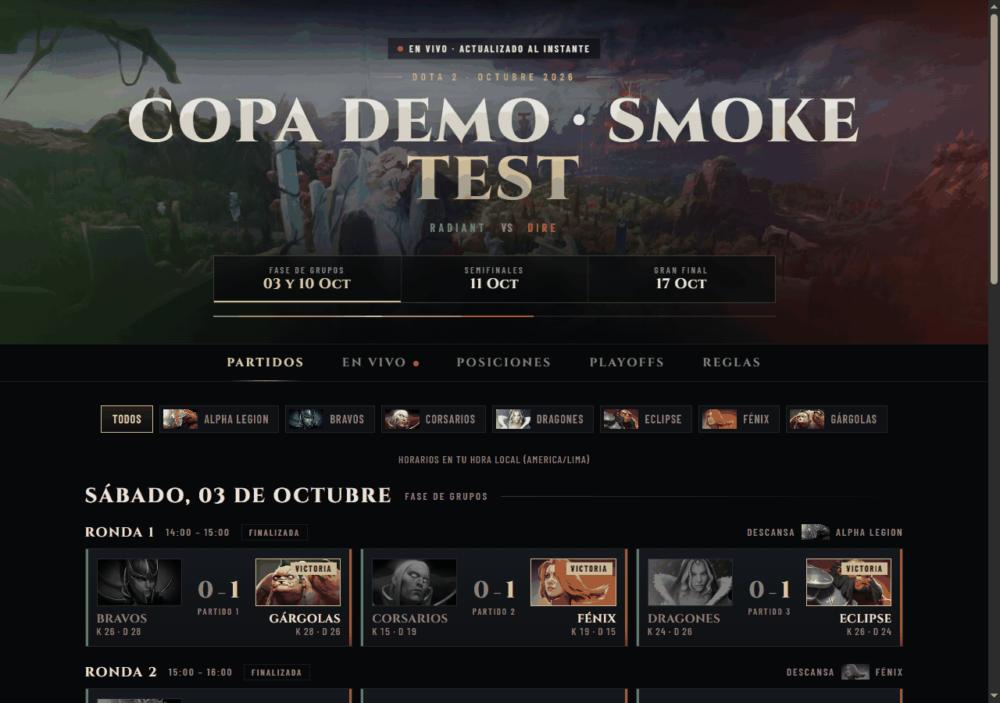
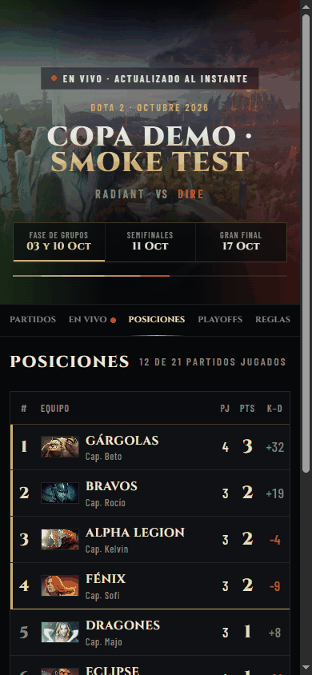
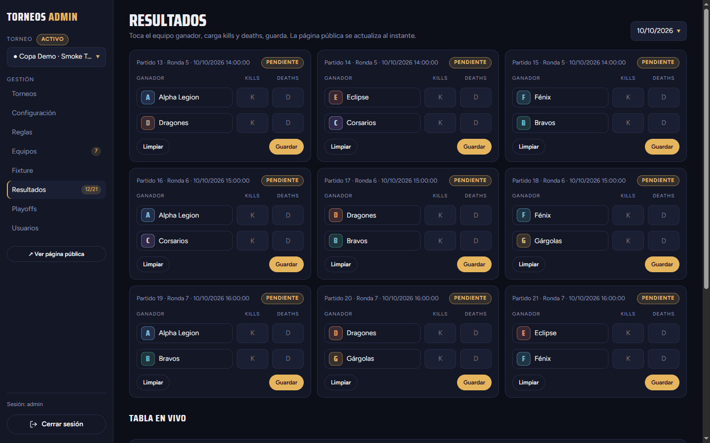
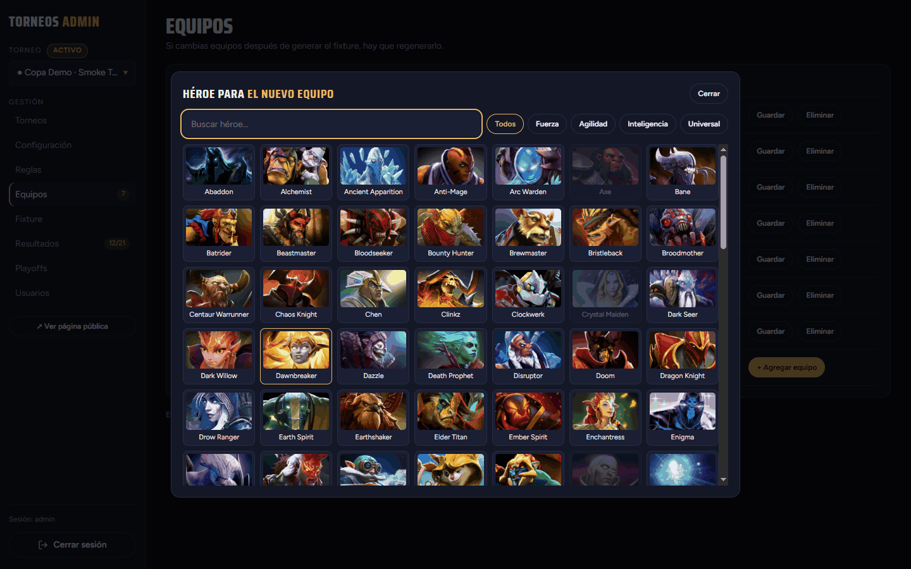

# torneo-dota

Aplicación web ligera y multitorneo para ligas de Dota 2. Genera un fixture de todos contra todos, registra los resultados en un panel de administración y permite que los jugadores sigan **la tabla en vivo, los playoffs y la transmisión** en una página pública que se puede incrustar en Google Sites.



## Qué incluye

- **Generador de fixture**: todos contra todos a una o dos vueltas, para cualquier número de equipos, con un descanso por ronda cuando el número es impar. Ediciones manuales: mover partidos, agregar rondas o partidos y agregar un partido de desempate.
- **Resultados y posiciones**: los administradores registran el ganador y las kills/deaths; la tabla siempre se calcula a partir de los resultados (no se guardan puntos).
- **Playoffs**: clasifican los 4 primeros, semifinales 1.º vs 4.º y 2.º vs 3.º, final y campeón.
- **Series de varios juegos**: cada fase se juega al mejor de 1, 3 o 5 (por defecto: grupos 1, semifinales 3, final 5; se cambia en Reglas > Formato > «Partidas por partido»). Gana quien llegue primero a la mitad más uno; las kills y deaths del partido son la suma de sus juegos.
- **Importar un juego desde Dota**: en Resultados y Playoffs cada juego admite un Match ID de Dota. La app consulta OpenDota desde el servidor, autocompleta ganador, kills y deaths, y la web pública muestra «Ver detalle de la partida» con jugadores, héroes y estadísticas (ver «Partidas de Dota» más abajo).
- **Página pública en vivo** con estética de Dota 2 (interfaz en español): Partidos, En vivo, Posiciones, Playoffs, Reglas. Se actualiza sin recargar.
- **Pestaña de transmisión**: un enlace de Kick, Twitch o YouTube por torneo, incrustado en la página pública.
- **Varios torneos**: uno está *activo* y se muestra en `/`; además, cada torneo tiene su propia URL para el archivo histórico.
- **Vista previa al compartir**: cada enlace público muestra en WhatsApp, Telegram o Discord una imagen y un texto que cambian según el estado del torneo (grupos, en vivo, semifinales, campeón). La imagen se regenera con `npm run render:og`.
- **Imagen propia del equipo**: además de elegir un héroe, cada equipo puede subir una imagen. El panel la recorta a 16:9 (Cropper.js incluido en el proyecto, sin CDN), el servidor la valida y la convierte a WebP optimizado (512×288 y 1024×576), y se guarda en Cloudflare R2 (o en una carpeta local en desarrollo). El emblema es un héroe o la imagen propia, nunca los dos. Los cambios de la pantalla Equipos se preparan en las filas y se guardan todos juntos con «Guardar cambios», así que un héroe puede pasar de un equipo a otro en un solo guardado.
- **Zonas horarias**: las horas de los partidos se guardan en UTC; cada visitante ve su hora local.
- **Panel de administración** (acceso con contraseña, varios administradores, todos con el mismo rol): torneos, reglas, equipos con emblema de héroe (127 héroes, retratos alojados en el propio proyecto) o con su propia imagen, fixture, resultados, playoffs y usuarios.

## Capturas de pantalla

| Página pública en un teléfono | Panel: resultados |
| --- | --- |
|  |  |



## Inicio rápido

**Requisitos previos:** Node.js 22 o superior y npm. Se desarrolló y probó con Node 24; no hay un campo `engines`.

```bash
npm ci
cp .env.example .env   # opcional: ajustes locales (puerto, contraseña, R2); ver más abajo
npm run dev
```

Luego abre:

| URL | Contenido |
| --- | --- |
| <http://localhost:3000/> | Página pública del torneo activo ("Próximamente" hasta que haya uno activo) |
| <http://localhost:3000/admin> | Panel de administración. Con una base de datos nueva, te lleva a la configuración inicial |

**Primer arranque: crear el primer administrador.** Elige una opción:

| Opción | Cómo |
| --- | --- |
| Página de configuración inicial (por defecto) | Inicia el servidor. Imprime `Setup required: open /admin/setup and use code: <código>`. Abre `/admin/setup` e ingresa un usuario, una contraseña (de 8 a 200 caracteres, con confirmación) y ese código |
| `ADMIN_PASSWORD` | Inicia con `ADMIN_PASSWORD='elige-una-contraseña' npm run dev`: el administrador `admin` se crea al arrancar y nunca se muestra la configuración inicial |

- El código de configuración generado es aleatorio (192 bits), se imprime **una sola vez** en la salida del servidor y cambia en cada arranque. Para usar uno propio, define `ADMIN_SETUP_TOKEN`.
- `/admin/setup` solo existe mientras no haya administradores; después responde 404. Los intentos tienen límite de frecuencia, igual que el inicio de sesión.
- Después, gestiona los usuarios en el panel (**Usuarios**). Cada administrador puede cambiar su propia contraseña desde la barra lateral (**Cambiar contraseña**), lo que además cierra sus otras sesiones.
- **Archivo `.env` (opcional, solo desarrollo).** `npm run dev`, `npm run seed:oct2026` y `npm run render:og` leen `./.env` si existe (con `--env-file-if-exists` de Node, sin dependencias nuevas). Está en `.gitignore`; parte de `.env.example`, que lista `PORT`, `DATABASE_PATH`, `ADMIN_PASSWORD` y las variables `R2_*`. `npm start` y Docker **no** lo leen. Si defines solo algunas de las cinco `R2_*`, el servidor no arranca y te dice cuáles faltan.
- La base de datos SQLite se crea en `./data/torneos.db` en el primer arranque y se migra automáticamente.
- Datos de demostración opcionales: `npm run seed:oct2026` crea *Torneo All vs All · Oct 2026* (7 equipos, 21 partidos) y lo deja activo. Se puede ejecutar dos veces sin problema (no hace nada si el torneo ya existe).

Lista de pasos para un torneo nuevo (en el panel):

- [ ] **Torneos**: crear el torneo y marcarlo como activo
- [ ] **Configuración**: nombre, slug, juego, zona horaria, días del calendario y horas de inicio
- [ ] **Reglas**: puntos, criterios de desempate, formato (una o dos vueltas), texto del reglamento
- [ ] **Equipos**: agregar los equipos y elegir un emblema de héroe para cada uno
- [ ] **Fixture**: generarlo y, si hace falta, ajustarlo a mano
- [ ] **Resultados**: registrar los resultados a medida que terminan los partidos

## Configuración

El servidor lee estas variables de entorno:

| Variable | Valor por defecto | Propósito |
| --- | --- | --- |
| `PORT` | `3000` | Puerto HTTP |
| `DATABASE_PATH` | `./data/torneos.db` | Archivo SQLite (su carpeta se crea si no existe) |
| `ADMIN_PASSWORD` | ninguno | Opcional. Si está definida y no hay administradores, crea al arrancar el administrador `admin` con esta contraseña. Sin ella, el primer administrador se crea en `/admin/setup` |
| `ADMIN_SETUP_TOKEN` | aleatorio en cada arranque | Código que exige `/admin/setup`. Si no se define, se genera uno aleatorio y se imprime una sola vez al arrancar (consulta la salida del servidor; con Docker, los registros del contenedor) |
| `COOKIE_SECURE` | desactivado | `1` o `true`: marca la cookie de sesión como `Secure`. Actívalo cuando se sirva por HTTPS |
| `TRUST_PROXY` | desactivado | `1` o `true`: confía en `X-Forwarded-For` / `X-Forwarded-Host` de un proxy inverso (ver más abajo) |
| `PUBLIC_BASE_URL` | vacío | URL pública de la app (por ejemplo `https://torneo-dota.jpsolutions.app`, sin barra final) para las URL absolutas de la vista previa al compartir. Vacío: se usa el origen de la solicitud (respetando `TRUST_PROXY`) |
| `R2_ACCOUNT_ID`, `R2_ACCESS_KEY_ID`, `R2_SECRET_ACCESS_KEY`, `R2_BUCKET`, `R2_PUBLIC_BASE_URL` | vacías | Almacenamiento de las imágenes de equipos en Cloudflare R2 (bucket público). Son **todo o nada**: si defines solo algunas, el servidor no arranca y lista las que faltan. Cómo crearlas: `deploy/README.md` |
| `IMAGE_STORE` | vacío | `local` guarda las imágenes en una carpeta y las sirve la app en `/uploads`. Sin R2 es el comportamiento en desarrollo; en producción, sin R2 y sin `local`, las imágenes personalizadas se desactivan |
| `IMAGES_DIR` | `./data/uploads` (`/data/uploads` en Docker) | Carpeta del almacenamiento local |
| `STREAM_PARENT_HOSTS` | vacío | Hosts, separados por comas, autorizados a incrustar el reproductor de Twitch. Vacío significa el host de la solicitud más `sites.google.com` |

`TRUST_PROXY` supone **exactamente un** proxy de confianza delante (por ejemplo, Caddy en el mismo servidor). El limitador de intentos de inicio de sesión usa entonces la entrada más a la derecha de `X-Forwarded-For`, la que agregó el proxy.

## Cómo funciona

### Rutas

| Ruta | Descripción |
| --- | --- |
| `/` | Página pública del torneo activo |
| `/t/:slug` | Página pública de cualquier torneo (archivo); 404 en español si no existe |
| `/partial`, `/t/:slug/partial` | El contenido de la página como fragmento HTML (se usa para la actualización en vivo) |
| `/events`, `/t/:slug/events` | Flujo de eventos enviados por el servidor, SSE (`hello`, `change`, `ping`) |
| `/robots.txt` | Permite las páginas públicas y excluye `/admin` |
| `/healthz` | Estado de salud para Docker/monitoreo: `200 {"status":"ok"}` si la base responde, `503` si no |
| `/admin` | Panel: abre los resultados del torneo activo |
| `/admin/setup` | Configuración inicial (solo mientras no haya administradores; después, 404) |
| `/admin/cuenta` | Cambiar tu propia contraseña |
| `/admin/torneos`, `/admin/usuarios` | Lista de torneos y usuarios administradores |
| `/admin/t/:id/{config,reglas,equipos,fixture,resultados,playoffs}` | Pantallas de cada torneo |
| `/assets/*` | CSS, JS, imágenes y retratos de héroes |

Las páginas públicas no envían cabeceras que impidan incrustarlas, por lo que se muestran dentro de un iframe de Google Sites. El panel envía `X-Frame-Options: DENY` y `frame-ancestors 'none'`.

### Reglas

- Los puntos por victoria y por derrota se configuran en cada torneo (por defecto **victoria 1, derrota 0**; no hay empates).
- Clasificación: primero los puntos y, después, los criterios de desempate configurados **en el orden elegido** (Reglas > Desempate). Se pueden reordenar, quitar (incluso todos) y agregar. Cada criterio se aplica solo a los equipos que siguen empatados:
  - **Diferencia K − D** y **Más kills**: los de las partidas del fixture.
  - **Resultado directo** (resultado jugado entre los empatados): entre 2 equipos gana quien ganó su partido; entre 3 o más cuenta una mini-liga con los partidos jugados solo entre ellos.
  - **Juego adicional**: una partida extra entre los empatados (Fixture > *Agregar partida de desempate*). No cuenta para puntos, victorias, kills, K−D ni partidos jugados; solo la usa este criterio. Mientras el empate en la zona de clasificación siga sin decidirse, la tabla indica **"Pendiente de juego adicional"**.
  - Por defecto: K−D y luego más kills.
- Si un empate sobrevive a todos los criterios, se marca como **"Empate sin resolver"** y los equipos de las semifinales se eligen a mano (Playoffs > Elegir equipos manualmente).
- Avanzan los **4 primeros**. Semifinales: 1.º vs 4.º y 2.º vs 3.º. Los ganadores juegan la final.
- Mientras la fase de grupos está en curso, la pestaña Playoffs muestra una *proyección* con la tabla actual.

### Partidas de Dota

**Cómo obtener el Match ID.** En el cliente de Dota 2 abre tu perfil, entra en el historial de partidas y elige la partida: el número de 10 dígitos aparece en el detalle (junto al título, con un botón para copiarlo). También es el número al final de la dirección de la partida en Dotabuff u OpenDota.

**Cómo importarlo.** En **Resultados** (o **Playoffs**), abre «Importar desde Dota» en el juego, pega el Match ID y pulsa **Buscar**. Si aparece «✓ Partida encontrada · mm:ss · 42 – 41» (primero el marcador del ganador), elige **quién ganó esta partida** y pulsa **Autocompletar**: se rellenan el ganador y las kills/deaths (kills = puntaje de cada bando; deaths = suma de las muertes de sus jugadores). La app deduce sola qué equipo jugó de Radiant a partir de quién ganó, y lo usa en el detalle público. Revisa y **Guarda**: el detalle de la partida se guarda con el juego. Si cambias los números a mano después de autocompletar, la app no guarda el detalle (no podría coincidir con el marcador); quita el Match ID para cargar el juego solo a mano. Sin Match ID todo funciona como siempre.

**Privacidad.** OpenDota solo tiene las partidas de jugadores que activaron **«Exponer datos públicos de partidas»** (en Dota 2: Ajustes > Opciones > Avanzadas). Si ningún jugador lo activó, la partida no se encuentra o sus jugadores salen como «Anónimo». De cada partida se guarda solo lo necesario para mostrarla: nick público, héroe, kills/deaths/asistencias, nivel, oro y experiencia por minuto, last hits/denies, daño, baneos, duración y primera sangre; no se guardan IDs de cuenta ni la respuesta completa del proveedor. Las consultas a OpenDota se hacen siempre desde el servidor (timeout de 8 s, un reintento ante errores 5xx, caché de 10 minutos) y con límite de frecuencia por administrador.

### Zonas horarias

| Dónde | Comportamiento |
| --- | --- |
| Almacenamiento | El inicio y el fin de cada partido son instantes ISO en UTC |
| Panel de administración | Los campos y las etiquetas usan la **zona horaria del torneo** (por defecto `America/Lima`, editable en Configuración) |
| Página pública | Las horas y los encabezados de día usan la zona del **visitante**, con una nota como "Horarios en tu hora local (Europe/Madrid)". Sin JavaScript, el servidor muestra la zona del torneo |

Cambiar la zona de un torneo mantiene los partidos existentes en el mismo instante; solo cambia cómo se leen. "En juego" y "Siguiente" se calculan con instantes reales.

### Tiempo real

- Al guardar en el panel se emite un evento dentro del proceso. Las páginas públicas conectadas reciben `change` por SSE, vuelven a pedir `/partial` y lo reemplazan, conservando la pestaña seleccionada y el filtro de equipo.
- Se envía un latido cada 25 s. Las conexiones tienen un tope (500 en total y 10 por cliente; las demás reciben `503`). El cliente se reconecta con retroceso exponencial acotado.
- **Ejecuta una sola instancia.** Los eventos viven en memoria, así que un segundo proceso de Node no avisaría a los visitantes del primero.

### Transmisión en vivo

Define el enlace en **Configuración > Transmisión en vivo**. La pestaña pública "En vivo" lo incrusta (un punto rojo marca la pestaña mientras haya transmisión configurada).

| Plataforma | Enlaces aceptados |
| --- | --- |
| Kick | `kick.com/<canal>` |
| Twitch | `twitch.tv/<canal>`, `twitch.tv/videos/<id>` |
| YouTube | `watch?v=`, `youtu.be/`, `/live/<id>`, `/embed/<id>`, `/channel/UC…/live` (los enlaces con `@usuario` no se pueden incrustar) |

- Solo se aceptan enlaces `https`; la URL de incrustación se reconstruye a partir de las partes validadas, nunca desde el texto original.
- **Hosts padre de Twitch:** Twitch solo reproduce en páginas cuyo host se le indicó. Por defecto, esta aplicación le informa el host de la solicitud y `sites.google.com`. Si Twitch no se reproduce dentro de tu página de Google Sites, el host que la incrusta puede ser un subdominio de `*.googleusercontent.com`: agrégalo a `STREAM_PARENT_HOSTS`.
- Los **bloqueadores de anuncios** pueden bloquear los reproductores incrustados. La pestaña indica a los visitantes que lo desactiven o que abran la página del canal.
- Twitch documenta un tamaño mínimo de reproductor de 400×300 px. El marco es un 16:9 adaptable, así que en teléfonos muy estrechos puede ser más pequeño que eso.

## Arquitectura

**Tecnologías:** Node.js + TypeScript, [Hono](https://hono.dev) con renderizado en servidor mediante `hono/jsx`, `better-sqlite3` (SQL, sin ORM), JavaScript sin frameworks en el cliente (sin paso de compilación) y Vitest. En desarrollo `tsx` ejecuta el TypeScript directamente; en producción se compila a `dist/` y se ejecuta con `node`.

```text
src/
  server.ts, app.ts   punto de entrada y composición de la aplicación
  config.ts, clock.ts opciones de entorno, reloj inyectable
  db/                 ejecutor de migraciones, conexión, repositorio (todo el SQL vive aquí)
  domain/             lógica pura: fixture, posiciones, playoffs, enlaces de transmisión
  services/           casos de uso que combinan repositorio y dominio
  admin/              rutas y vistas del panel
  public/             modelo público (datos de la vista), rutas, vistas, SSE
  auth/               contraseñas, sesiones, limitador de inicio de sesión
  format/             formato de fechas y aritmética de zonas horarias
  data/               lista de héroes
  storage/            puerto ImageStore y adaptadores (Cloudflare R2 con SigV4, carpeta local)
  images/             validación y conversión de imágenes con sharp
  dota/               puerto DotaMatchSource, adaptador de OpenDota y mapeo a una ficha compacta de la partida
migrations/           archivos SQL solo hacia adelante: 001_init.sql ... 008_match_games.sql
deploy/               despliegue con Docker: compose, .env de ejemplo, bloque de Caddy y guía
Dockerfile            imagen de producción (varias etapas, compila a dist/)
public/               archivos estáticos: CSS, JS del cliente, retratos de héroes, imágenes
scripts/              datos de ejemplo y descargador de retratos de héroes
test/                 pruebas con Vitest (SQLite en memoria)
odd/                  plan de la funcionalidad, maquetas y registro de revisiones
docs/screenshots/     imágenes usadas en este README
```

**Migraciones:** los archivos `migrations/NNN_name.sql` se aplican en orden al arrancar, cada uno en una transacción, y la versión se guarda en `PRAGMA user_version`. La aplicación no arranca si alguna falla. Son solo hacia adelante: **nunca edites una migración que ya se aplicó**; agrega un archivo nuevo.

## Desarrollo

| Comando | Qué hace |
| --- | --- |
| `npm run dev` | Inicia con observación de archivos (`tsx watch`) y carga `./.env` si existe |
| `npm run build` | Compila TypeScript a `dist/` (`tsc -p tsconfig.build.json`) |
| `npm start` | Inicia la versión compilada (`node dist/server.js`); ejecuta antes `npm run build` |
| `npm test` | Ejecuta todas las pruebas una vez (`vitest run`) |
| `npm run typecheck` | `tsc --noEmit` |
| `npm run seed:oct2026` | Carga el torneo de octubre de 2026 (idempotente) |
| `npm run render:og` | Regenera `public/img/og.jpg` y `apple-touch-icon.png` con Chrome (necesita Chrome instalado o `CHROME_PATH`) |
| `npm run fetch:heroes` | Descarga los retratos de héroes que falten en `public/heroes/` (ya están incluidos en el repositorio; usa `-- --force` para volver a descargarlos) |

- **TDD:** primero se escribe la prueba que falla y después el código. Las pruebas de rutas usan `app.request()` sobre una base de datos en memoria.
- **Commits:** [Conventional Commits](https://www.conventionalcommits.org) (`feat:`, `fix:`, `docs:`, ...), un cambio revisable por commit, con sus pruebas.
- Los ejecutores de pruebas están limitados a dos procesos de trabajo a propósito (`VITEST_MAX_WORKERS`); no lo aumentes en una máquina compartida.

## Despliegue

Se despliega con **Docker** detrás de un Caddy existente. La imagen se construye dentro de Docker desde GitHub, así que en el servidor no hace falta instalar node, npm ni git.

```bash
# en el servidor, con deploy/compose.yml y un .env (ver deploy/.env.example)
docker compose up -d --build
```

Guía completa en español, con primer despliegue, actualización, reversión, copias de seguridad y solución de problemas: **[deploy/README.md](deploy/README.md)**.

| Ajuste (en `.env`) | Motivo |
| --- | --- |
| `COOKIE_SECURE=1` | La cookie de sesión solo se envía por HTTPS |
| `TRUST_PROXY=1` | Dirección de cliente correcta para el límite de inicios de sesión y host correcto para Twitch |
| `DATABASE_PATH=/data/torneos.db` | El archivo SQLite vive en el volumen `torneo-dota_data` |

> **Los datos están en el volumen `torneo-dota_data`. `docker compose down -v` los borra.** Sobreviven a reinicios, caídas y actualizaciones; usa siempre `docker compose down` sin `-v`.

El primer código de configuración inicial aparece en `docker compose logs torneo-dota`; también puedes definir `ADMIN_PASSWORD` o `ADMIN_SETUP_TOKEN` en el `.env`. Para probar la imagen en local: `docker compose -f deploy/compose.local.yml up -d --build` (publica solo en `127.0.0.1:3097`).

**Copias de seguridad:** ver `deploy/README.md` (copia consistente con la app en marcha usando la API de copia de SQLite).

## Créditos y aviso legal

Hecho por **jpsolutions** — <https://jpsolutions.app>

Dota 2 y las ilustraciones de héroes son marcas/copyright de Valve Corporation; este proyecto no está afiliado ni respaldado por Valve.

Licencia: por definir.
